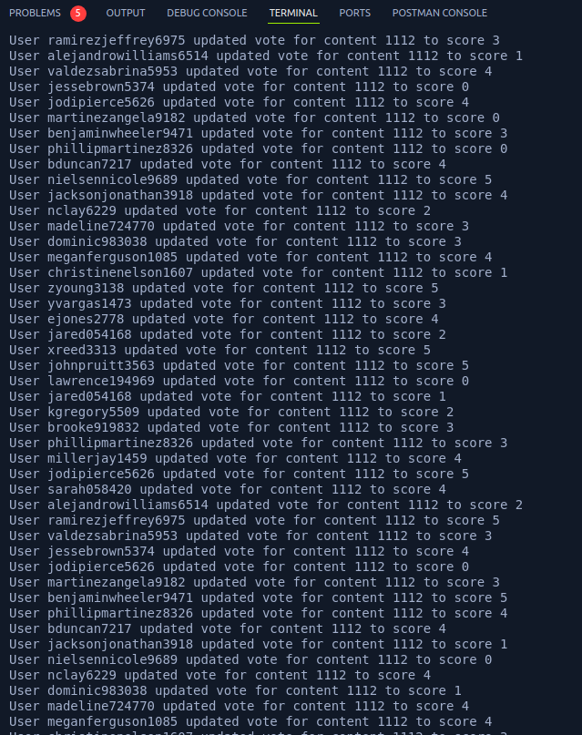
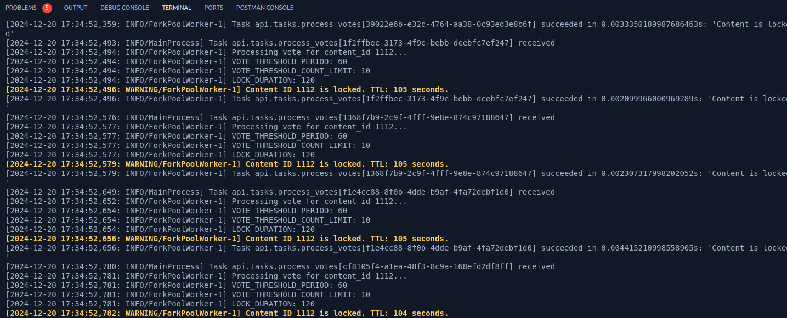
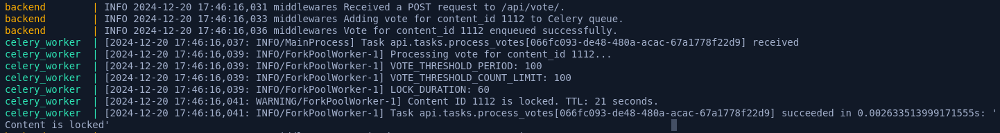
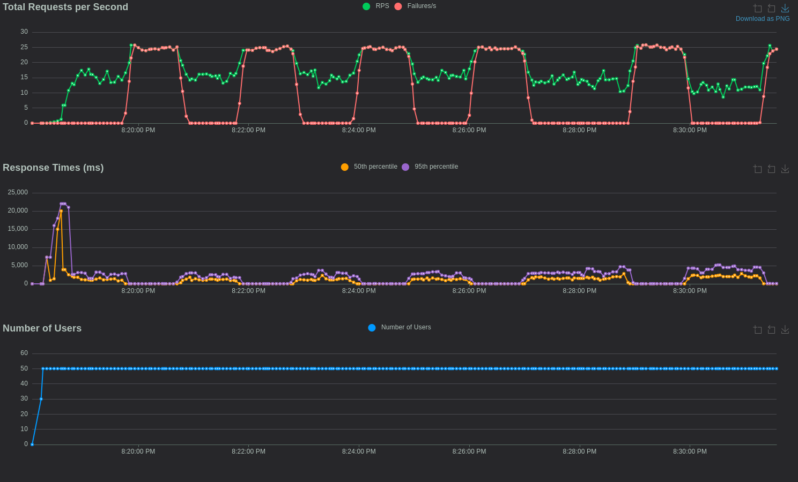

# **Django Voting API with Celery Integration**

## **Overview**
This is a Django-based voting system designed for high-traffic scenarios. The application uses:
- **Redis** for rate-limiting and vote locking.
- **Celery** for processing votes asynchronously.
- **PostgreSQL** as the database backend.

The system is capable of handling large numbers of votes while ensuring fair voting through rate-limiting and locking mechanisms.

---

## **Features**
1. **User Registration and Authentication**:
   - User registration API.
   - JWT-based authentication.

2. **Content Management**:
   - API for creating and retrieving content.
   - Pagination support for large content lists.

3. **Voting System**:
   - Users can vote or update their vote on content.
   - Votes are processed asynchronously using Celery and Redis.
   - Implements rate-limiting and locking to prevent abusive voting patterns.

4. **Background Tasks**:
   - Celery processes votes asynchronously from a Redis queue.
   - Automatic updates of average vote for content.

5. **Load Testing**:
   - Locust-based load testing scripts simulate user interactions with the system.

---

## **Technologies Used**
- **Django**: Web framework for the application.
- **Django REST Framework (DRF)**: For building RESTful APIs.
- **PostgreSQL**: Database for content, votes, and users.
- **Redis**: For caching, rate-limiting, and as a Celery broker.
- **Celery**: For asynchronous task processing.
- **Locust**: For load testing and simulating user behavior.

---

## **Setup Instructions**

### Prerequisites
- **Docker** and **Docker Compose** installed.
- Python 3.10+ installed locally for development/testing (optional).

---

### **Environment Variables**

Create a `.env` file in the project root with the following variables:

```env
DJANGO_SETTINGS_MODULE=config.settings.stage
SECRET_KEY=your-secret-key
DEBUG=True
ALLOWED_HOSTS=*
DB_ENGINE=django.db.backends.postgresql
DB_NAME=bitpindb
DB_USER=bitpinuser
DB_PASSWORD=bitpinpassword
DB_HOST=db
DB_PORT=5432
REDIS_HOST=redis
REDIS_PORT=6379
REDIS_DB=1
VOTE_THRESHOLD_PERIOD=60
VOTE_THRESHOLD_COUNT_LIMIT=10
LOCK_DURATION=120
```

---

### **Run the Application with Docker Compose**

1. **Build and Start Services**:
   ```bash
   docker-compose build
   docker-compose up
   ```

2. **Services Started**:
   - **Backend**: Django app on `http://127.0.0.1:8003`
   - **Redis**: Running as a message broker and cache.

3. **Celery Worker**:
   - A separate container processes the `vote_queue` for asynchronous tasks.

---

### **Endpoints**

| Endpoint               | Method | Description                          | Authentication |
|------------------------|--------|--------------------------------------|----------------|
| `/api/register/`       | POST   | User Registration                    | No             |
| `/api/auth/`           | POST   | User Login (JWT Token)               | No             |
| `/api/contents/`       | POST   | Create Content                       | No             |
| `/api/contents/`       | GET    | List All Content (Paginated)         | No             |
| `/api/contents/<pk>/`  | GET    | Retrieve Content Details             | Yes & No       |
| `/api/vote/`           | POST   | Vote or Update Vote on Content       | Yes            |

---

## **Core Logic**

### **Middleware: Rate Limiting and Locking**
- Checks if a content is locked before allowing a vote.
- Tracks vote counts using Redis keys.
- Applies locks when thresholds are exceeded.

### **Signals**
- Updates the average vote of content when a vote is saved using `post_save`.

### **Celery Tasks**
- `process_votes`: Handles vote counting and locking logic asynchronously.

---

## **How to Test**

### **1. Run Locust for Load Testing**

Run the load test with Locust:
```bash
locust -f locust.py
```

Access the Locust dashboard at `http://127.0.0.1:8089`. Simulate multiple users performing the following:
- User registration
- Content creation
- Voting on content

### **2. Manual API Testing**
Use tools like **Postman** or **curl** to manually test the endpoints.

Example: Voting on Content
```bash
curl -X POST http://127.0.0.1:8003/api/vote/ \
-H "Content-Type: application/json" \
-H "Authorization: Bearer <JWT_TOKEN>" \
-d '{"content": 1234, "score": 4}'
```

---

## **File Structure**

### **Key Files**
- `signals.py`:
  Updates the average vote of a content using `post_save`.

- `tasks.py`:
  Celery task to process votes, enforce rate limits, and handle locking.

- `views.py`:
  Contains API views for user registration, content creation, and voting.

- `locust.py`:
  Load testing scripts to simulate user and voting activity.

---

## **Example Workflows**

### **1. User Workflow**
1. User registers via `/api/register/`.
2. Logs in using `/api/auth/` to obtain a JWT token.
3. Creates content via `/api/contents/`.
4. Votes on content via `/api/vote/`.

### **2. Vote Processing**
1. Middleware enqueues the vote in the Redis queue.
2. Celery worker processes the vote asynchronously:
   - Increments vote count.
   - Applies locks if thresholds are exceeded.
3. The signal updates the content's average vote.

---

## **Performance Considerations**
- **Redis**:
  - Used for high-speed locking and rate-limiting.
- **Celery**:
  - Offloads processing of votes to background workers.
- **Locust**:
  - Simulates realistic user behavior for load testing.


### **Performance Results**

Here are screenshots showcasing the system's performance under load testing:

#### 1. **API Vote Logs**
The logs show users updating their votes on the same content. Rate limits and locks are enforced when thresholds are exceeded.



#### 2. **Celery Worker Logs**
Celery processes the votes in the background. When a rate limit is exceeded, content is locked for a predefined duration.




#### 3. **Performance Metrics: Requests per Second**
The graph shows request throughput and failure rates over time. Failures occur due to enforced rate limits.



#### 4. **Performance Metrics: Response Times**
Response times remain stable under load except when rate limits are triggered.


---
